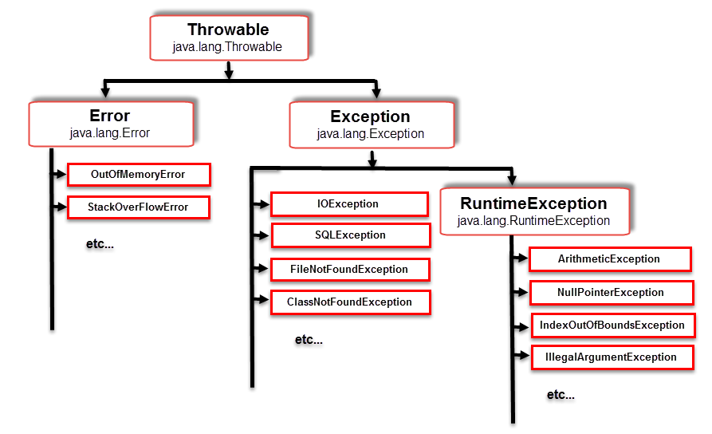

# Семинар 3

## Пятиминутка

1. Что такое класс?
2. Что такое сборщик мусора?
3. Что такое конструктор объекта?
4. Что такое пакет в Java?
5. Что такое библиотека в Java?


*Ответы:*
1. Множество объектов, обладающих сходным состоянием и поведением.
2. Часть исполняющей среды Java, обнаруживающая участки памяти, на которых нет ссылок в коде, и освобождающая их.
3. Функция (процедура), исполняющаяся во время создания объекта, которая инициализирует его начальное состояние.
4. Способ группировки классов и ограничения пространства имён.
5. Это набор собранных в байткод классов Java (.class), собранных в .jar-файл.

## Исключения

Мы уже сталкивались с ситуацией, когда в функции происходит какая-то ошибка. Что вы обычно делаете в таком случае?
В Си принято либо возвращать код ошибки, либо возвращать -1 и взводить код ошибки в errno. С одной стороны, это хорошо - мы явно обозначаем возможные ошибки в сигнатуре функции (частью которой они и являются), но с другой - мы заставляем пользователя штатно обрабатывать ситуацию, которая в штатном режиме, вообще говоря, не должна возникать. Для обскакивания этого придумали исключения.

Вообще говоря, исключения есть и в Haskell, но в функциональщине это моветон.

Исключение - это объект, который как бы можно "выбросить". Выброс исключения прерывает текущий поток исполнения, и "разматывает" стек вызовов до тех пор, пока будет найден обработчик этого исключения. Это записывается так:

```Java
try {
  throw new Exception("Smth bad occurred");
} catch (Exception e) {
  e.printStackTrace();
}
```

В Java исключения - это часть сигнатуры, поэтому если вы вероломно выкидываете исключение и не обрабатываете его - вы должны явно скорректировать сигнатуру метода:

```Java
public void processFile(String fileName) throws FileNotFoundException {
  // Do smth...
}
```

### Иерархия исключений

Исключения организованы в иерархию:



Для начала, все исключения наследуются от класса `Throwable` - только наследников этого класса можно выбросить с помощью `throw` (ловить можно всё, что кидается). Затем, иерархия разделяется на две ветки:
- Собственно, исключения (Exceptions) - ситуации, после которых обычно хочется и можно восстановиться
  - Среди них есть ветка наследников `RuntimeException` - исключения, возникающие при вычислении выражений. Они как бы не являются частью сигнатуры никакого метода, поэтому при их выбросе без обработки вы не обязаны указывать их через `throw`. Из-за этого факта `RuntimeException`ы называются unchecked (в противовес остальным исключениям, которые checked).
- Ошибки (Errors) - ситуации, после которых обычно не хочется или нельзя восстанавливаться. Обычно их кидает не ваш код, а сама JVM. Ошибки тоже являются unchecked.

Т.к. исключения выстраиваются в иерархию, их обработчики тоже выстраиваются в иерархию. При этом срабатывает всегда только один:

```Java
try {
  throw new FileNotFoundException();
} catch (FileNotFoundException e) {
  System.out.println("file not found");
  e.printStackTrace();
} catch (IOException e) {
  // Ловит все IOException, в том числе его наследника FileNotFoundException.
  // Но для FileNotFoundException этот блок не сработает, т.к. есть предыдущий.
  // Тут компилятор сможет осознать, что кроме FileNotFoundException вы
  // ничего не выкидываете, и предупредит вас, что что-то вы делаете не так.
  System.out.println("io");
  e.printStackTrace();
} catch (Exception e) {
  // А вот тут предупреждения не будет, т.к. Exception включает в себя
  // RuntimeException, а их наличие компилятор из одних только сигнатур вывести
  // не может.
  System.out.println("exception");
  e.printStackTrace();
}
```

Если же вы сначала расположите обработчик суперкласса, а потом - обработчик наследника, то компилятор совершенно возмутится столь явно недостижимому коду и не даст его собрать - в отличие от предупреждения выше.

### Блок `finally`

Код в catch выполняется только в случае возникновения исключения, код в try - только при его отсутствии. Но вам вполне может захотеться сделать что-нибудь в любой ситуации - например, закрыть файл. Для этого существует блок `finally`:

```Java
try {
  // Do smth...
} catch (Exception e) {
  // Handle this...
} finally {
  System.out.println("done anyway");
}
```

Важный нюанс: не стоит делать `return` внутри `finally`, т.к. если мы выполняем его при выбросе исключения, то `return` "затрёт" это исключение.

### try-with-resources

Закрытие файла - довольно частая операция, поэтому для такого придумали специальную конструкцию: try-with-resources:

```Java
// Можно указать несколько ресурсов через ';'.
try (FileReader reader = new FileReader("input.txt")) {
  // Do smth...
} catch (Exception e) {
  // Handle this...
} finally {
  System.out.println("done anyway");
}
```

В такой конструкции можно использовать любой класс, реализующий интерфейс `AutoCloseable`:

```Java
class A implements AutoCloseable {
  public A() {}

  @Override
  public void close() throws Exception {
    // Do closing.
  }
}
```

Если конструктор ресурса или его метод `close` выбросят исключение, то оно будет обрабатываться в том `catch`, в `try` которого мы захватили ресурс.

У этого интерфейса есть более специфицированный наследник: `Closeable`. Он отличается только тем, что метод `close` бросает `IOException` вместо `Exception`, как бы сужая круг исключений.

### Случай с несколькими исключениями

Представим такую ситуацию:

```Java
public static void main(String[] args) {
  try {
    executeApp();
  } catch (Exception e) {
    // Что мы увидим тут?
    System.out.println(e.getMessage());
  }
}

static void executeApp() {
  App app = new App();
  try {
    app.doSomethingImportant();
  } finally {
    app.close();
  }
}

void doSomethingImportant() {
  throw new Exception("Very important exception");
}

public void close() {
  throw new RuntimeException("Minor exception");
}
```

А увидим мы тут `"Minor exception"`. Вылет второго исключения при не обработанном до конца первом как бы затрёт его. Чтобы вылетело всё-таки первое исключение, можно ловить второе руками. Чтобы оно не затерялось, можно добавить его в "подавленные" исключения:

```Java
Throwable throwable = null;
try {
  app.doSomethingImportant();
} catch (Throwable e) {
  throwable = e;
} finally {
  try {
    app.close();
  } catch (Exception e) {
    if (throwable != null) {
      throwable.addSuppressed(e);
      throw throwable;
    } else {
      throw e;
    }
  }
}
```

Либо можем воспользоваться try-with-resources:

```Java
try (App app = new App()) {
  app.doSomethingImportant();
}
```

Итог будет одинаков:

```Java
public static void main(String[] args) {
  try {
    executeApp();
  } catch (Exception e) {
    System.out.println(e.getMessage());  // "Very important exception"
    System.out.println(e.getSuppressed()[0].getMessage()]); // "Minor exception"
  }
}
```

## Файловый ввод-вывод

Для начала, есть класс `java.io.File` - эдакая ручка к самому файлу, а не к данным в нём. Для создания этого объекта файл не обязан существовать. Через объект типа `File` можно
- проверить, существует ли он
- узнать его длину
- проверить права на файл
- создать, удалить
и т.д.

```Java
File file = new File("file.txt");
```

Когда мы вдоволь наигрались с файлом, можно создать на него поток:
```Java
InputStream in = new FileInputStream(file);
OutputStream out = new FileOutputStream(file);
```

Потоки - это абстракция для работы с потенциально бесконечным набором байт (не обязательно файловым).
Если нам неинтересно работать с байтами, создаём читателя и писателя:
```Java
Reader inputStreamReader = new InputStreamReader(in);
Writer outputStreamWriter = new OutputStreamWriter(out);
```

Или можно сразу создать его из файла:
```Java
Reader fileReader = new FileReader(file); // Или даже из имени файла!
Writer fileWriter = new FileWriter(file);
```

Эти ребята позволяют нам работать с файлами как с последовательностями символов. Но символы - это ещё не строка. Чтобы получить из них строку, нужно просто скормить массив символов конструктору строки.

Все вышеупомянутые потоки и читатели/писатели - ребята простые. Вы им сказали считать 9 байт - они сделали. Вот только каждый раз ходить на диск за такими маленькими порциями - дорогое удовольствие. Можно руками буферизовывать ввод/вывод - но стандартная библиотека уже умеет делать это за нас:
```Java
BufferedInputStream bIn = new BufferedInputStream(in);
BufferedOutputStream bOut = new BufferedOutputStream(out, /*bufferSize=*/ 1024);
BufferedReader bReader = new BufferedReader(inputStreamReader, /*bufferSize=*/ 8196);
BufferedWriter bWriter = new BufferedWriter(outputStreamWriter);
```

Ну а если работать с последовательностями символом для нас очень сложно, есть простой как валенок класс `Scanner`:
```Java
Scanner scanner = new Scanner(bIn);
int count = scanner.nextInt();  // Умеет читать не только int'ы.
int start = scanner.nextInt();  // Если в какой-то момент такого не будет - вылетит
int end = scanner.nextInt();    // NoSuchElementException. Или можно проверить
                                // руками через scanner.hasNextInt().
int[][] distances = new int[count][count];
for (int i = 0; i < count; ++i) {
  for (int j = 0; j < count; ++j) {
    distances[i][j] = scanner.nextInt();
  }
}
```

Как и в Си, пути к файлам принимаются либо относительные (от директории запуска программы), либо абсолютные. В случае запуска через IDE рабочей директорией будет корень проекта.

## Ещё полезные интерфейсы

- `Iterable<T>` - объекты, реализующие его, могут использоваться в цикле for-each: ```for (int i : myIterable) {...}```
- `Iterator<T>` - объект, позволяющий перебирать объекты типа `T` по одному
- `Collection<T>` - базовый интерфейс для коллекций (чуть побольше методов, чем итерирование)
- `Comparable<T>` - даёт возможность сравнивать объект с объектом типа `T` (используется для определения порядка на элементах)
- `Comparator<T>` - то же самое, но "внешний" объект (если вы работаете с уже готовыми типами)
- `Cloneable` - показывает, что объект можно склонировать (создать новый объект, такой же как предыдущий)

## Ссылки

- Java 8 Specification - https://docs.oracle.com/javase/specs/jls/se8/html/index.html
- Java 12 Specification - https://docs.oracle.com/javase/specs/jls/se12/html/index.html
- Java 8 API Specification - https://docs.oracle.com/javase/8/docs/api/index.html
- ...
Это спецификация - вы вряд ли будете читать это на ночь, но если вы не знаете, как что-то работает - вы идёте сюда.

